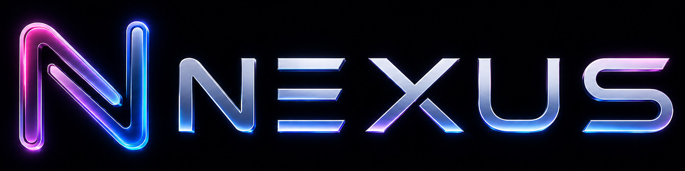

<p align="center">
  
</p>

<p align="center">
  <strong>The only self-hosted AI workspace that lives inside your digital life.</strong><br>
  Chat, agents, email, calendar, documents, research, model serving — all in one private, local-first platform.
</p>

<p align="center">
  <a href="#quick-start">Quick Start</a> ·
  <a href="docs/setup.md">Setup Guide</a> ·
  <a href="CONTRIBUTING.md">Contributing</a> ·
  <a href="ROADMAP.md">Roadmap</a>
</p>

<p align="center">
  <a href="https://repology.org/project/nexus-ai/versions"></a>
</p>

---

## Quick Start

> `dev` is the default branch and gets the newest changes first. Use [`main`](https://github.com/uuddhay/nexus/tree/main) if you want the more curated branch.

```bash
git clone https://github.com/uuddhay/nexus.git
cd nexus
cp .env.example .env
docker compose up -d --build
```

Open `http://localhost:7000` when the containers are healthy. The first admin password is printed in `docker compose logs nexus`.

Native installs, GPU notes, Windows/macOS instructions, HTTPS, and configuration live in the [setup guide](docs/setup.md).

## Features — *What no other platform can do*

### 📧 Email Inbox + AI Assistant
Full IMAP/SMTP integration with AI triage, urgency detection, summaries, reply drafts, tags, reminders, and attachment handling. *No other open-source AI platform has this.*

### 📅 Calendar + CalDAV Sync
Personal and shared calendars with month/week/day views, recurring events, color coding, attendees, reminders, and two-way CalDAV sync. *Nexus is the only AI workspace with a calendar.*

### 📝 Documents Editor
Full-featured writing editor with AI edits, inline suggestions, Markdown/HTML/CSV support, syntax highlighting, and document library. *Write with AI, not just chat with it.*

### 🧠 Chat + Autonomous Agents
Local and API models, tool calling, MCP servers, file uploads, shell access, skills (SKILL.md), memory, and web search. Agent loop with real-time progress visibility.

### 🔬 Deep Research
Multi-step autonomous web research: generates questions, searches, reads sources, iterates, and produces structured reports with citations. *Built-in researcher, not a separate tool.*

### 🍳 Cookbook — Model Serving
Hardware-aware model recommendations, one-click downloads, and local model serving (llama.cpp, vLLM). Knows what fits your GPU before you download.

### 🔗 Cross-Domain Intelligence (NEW)
Email → Tasks, Email → Calendar, Calendar → Research, Tasks → Email. The AI connects your data across domains because they all live in one place. *Only Nexus can do this.*

### 📋 Notes, Tasks + Calendar
Reminders, todos, scheduled agent tasks, recurring events, and a unified view of your day.

### 🎨 Extras
Gallery/image editor, themes, uploads, web search (DuckDuckGo, SearXNG, Brave, Tavily, + more), presets, sessions, 2FA, and MCP servers for email, image generation, memory, and RAG.

## Demo

A full hover-to-play tour lives on the landing page: [`docs/index.html`](docs/index.html).

## Contributing

Help is welcome. The best entry points are fresh-install testing, provider setup bugs, mobile/editor polish, docs, and small focused refactors. See [CONTRIBUTING.md](CONTRIBUTING.md) and [ROADMAP.md](ROADMAP.md).

## Security

Nexus is a self-hosted workspace with powerful local tools. Keep auth enabled, keep private data out of Git, and do not expose raw model/service ports publicly. Deployment details are in the [setup guide](docs/setup.md#security-notes).

## Star History

<a href="https://www.star-history.com/?repos=uuddhay%2Fnexus&type=date&legend=top-left">
 <picture>
   <source media="(prefers-color-scheme: dark)" srcset="https://api.star-history.com/chart?repos=uuddhay/nexus&type=date&theme=dark&legend=top-left" />
   <source media="(prefers-color-scheme: light)" srcset="https://api.star-history.com/chart?repos=uuddhay/nexus&type=date&legend=top-left" />
   
 </picture>
</a>

## License

AGPL-3.0-or-later -- see [LICENSE](LICENSE) and [ACKNOWLEDGMENTS.md](ACKNOWLEDGMENTS.md).
